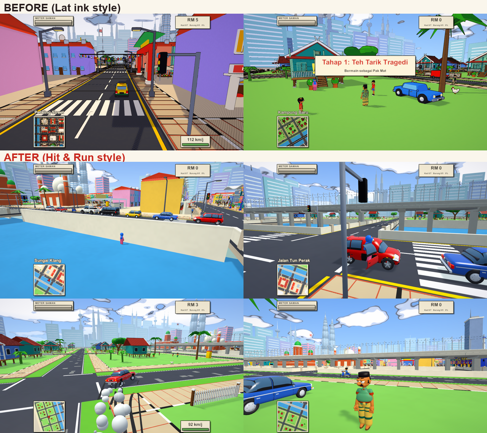
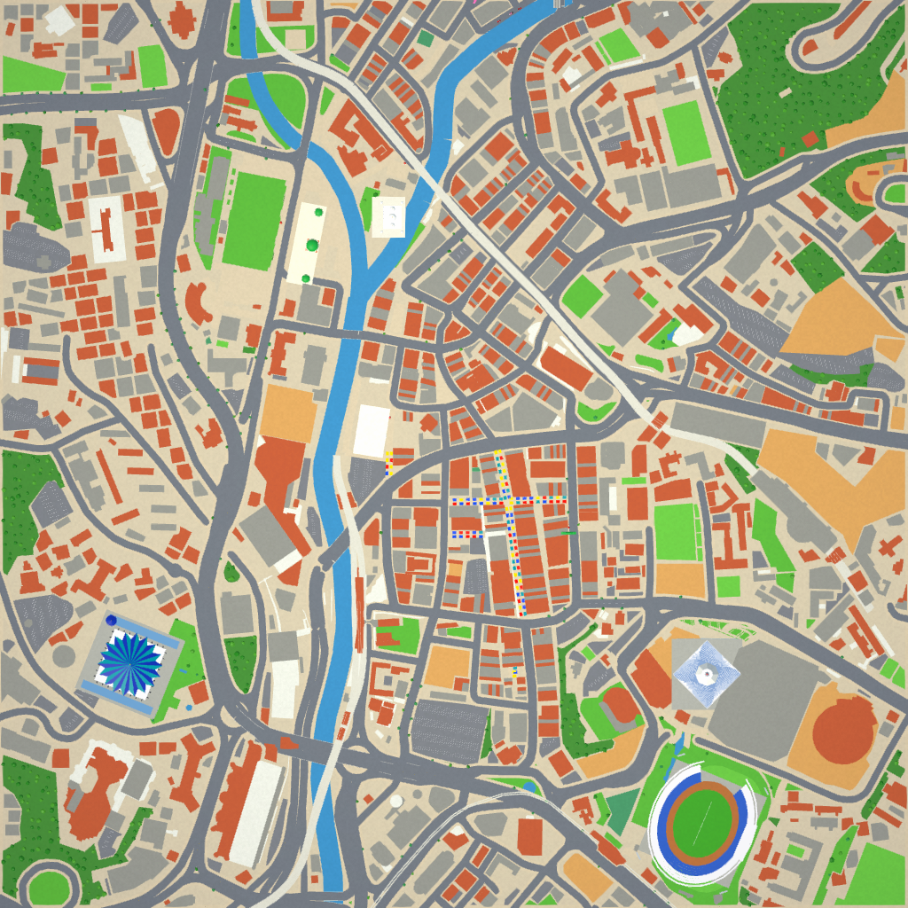

# Kampung Run: KL

A *Simpsons: Hit & Run*-style open-world game set in a compressed, cartoon Kuala Lumpur.
Smooth, soft-lit shading with hand-painted-style city textures, a refined Malaysian
cartoon cast based on approved character sheets, and detailed, fully animated
Malaysian cars: Myvi, classic Saga, Kancil, Alphard, Hilux 4x4, kapcai, teksi and polis.



Unity 6.6 (URP) + Blender 5.2. Every model, texture, the city, sounds and music are generated
from code (`Tools/`), so the art can be rebuilt and tweaked from scripts.

## Play

- **Refined character preview:** use *Kampung Run → Build Refined Character Preview (Windows)*.
  This builds the current scene into `Builds/RefinedCharacters/Windows/KampungRunKL.exe`
  without regenerating the scene or animation controller. [Character renders and verification](docs/character-concepts/round-02/README.md).
- **Browser:** build with *Kampung Run → Build WebGL (browser)*; the zip in `Builds/` is ready
  for itch.io (see `Builds/ITCH_PAGE.md`). Phones get touch controls.
- **Windows:** *Kampung Run → Build Windows Player*. Keep the project in a short path
  (e.g. `D:\Games\KampungRun`). Windows' 260-character path limit breaks both the
  Unity editor and the built game when they sit in a very deep folder.
- **In the editor:** open `Assets/Scenes/KampungRun.unity` and press Play. Set
  `Auto Start Level` on the *KampungRun* object to skip the title screen.

### Controls (keyboard / gamepad)

| Action | Keys | Pad |
|---|---|---|
| Move / steer | WASD | Left stick |
| Camera | Mouse | Right stick |
| Sprint | Shift | LB |
| Jump (double jump) / handbrake | Space | A |
| Punch (3-hit combo) | Q / Left click | B |
| Kick (in the air = stomp) | F / Right click | X |
| Get in/out of car, talk, shops | E | Y |
| Accelerate / brake-reverse | W / S | RT / LT |
| Horn (scares people) | H | L3 |
| Flip car back over | R | Back |
| Pause | Esc | Start |

## What's in it

- **4 levels, 4 playable family members** (Pak Mat, Mak Som, Along, Adik), each with
  5 story missions and a street race, at morning, afternoon, sunset and night.
- **Story:** MegaMaju Berhad and the round Datuk Mega are feeding KL a mind-control
  "Cendol Ajaib" and spying with robot mynah birds.
- **Mission types:** talk, timed drives, collect, destroy-the-car, tail-the-car,
  checkpoint races vs AI, smash things, shake the police.
- **Meter Saman** (the Hit & Run meter): run people over, smash stuff or punch the polis
  and it fills. When it's full the police chase you, and if they catch you it's
  "KENA SAMAN!" and a RM50 fine.
- **On foot:** walk, run, jump, double jump, punch combo, kick, jump-stomp. Take any car
  (drivers get thrown out) and get knocked over by traffic (you drop coins).
- **Collectibles per level:** 7 *Kad Lat* cards, 5 *Burung Kamera* (the H&R wasp
  cameras), coins everywhere, and crates and lamp posts to smash.
- **Shops:** Kedai Kereta (buy 7 extra cars), Kedai Baju (2 costumes per character),
  Pondok Telefon phone booths to call up any car you own.
- **The map:** about 2.1 x 2.3 km of KL, life-size, on an 18 x 20 grid of city blocks.
  - **Round the big landmarks it's the real city**, built from OpenStreetMap: the real streets
    (one-way streets, roundabouts and flyovers included), the Gombak and Klang meeting at Masjid
    Jamek, parks, car parks and the buildings with their windows and shopfronts. That covers:
    - the Old Town: Dataran Merdeka, Sultan Abdul Samad, Pasar Seni, the Petaling Street night
      market, Merdeka 118, the stadiums, Masjid Negara and the old railway station;
    - the Lake Gardens with Tugu Negara;
    - KL Sentral and Brickfields;
    - Bukit Nanas with Menara KL;
    - KLCC with the Twin Towers and the park;
    - Bukit Bintang.
  - **Kampung Baru** sits between the two rivers.
  - **In between**, free-form districts (Chow Kit, Jalan TAR, condos, office towers, TRX) come
    with their own flyovers and bulatan, plus Batu Caves, Thean Hou and Istana Negara.

  

- **Cars that feel alive:** body roll, brake dive, squat and landing bounce, idle shake, a
  turning steering wheel, doors that swing open and slam, brake/reverse/head lamps, a
  swinging tasbih and a wobbly antenna, exhaust puffs, tyre smoke and skid marks, and a
  visible driver in every car. Riders lean into corners with the kapcai.
- **Life:** pedestrians on the pavements (bop them H&R-style: they stagger, fall, get back up
  and grumble), AI traffic driving on the **left**, police chases.
- **HUD:** radar minimap, objective arrow, timers, district names, speedometer, save %,
  and procedural kompang-style music with synthesised sound effects.

## Project layout

```
Assets/KampungRun/
  Shaders/LatInk.shader     Hit & Run shading (soft light, gloss, painted triplanar textures, lamps)
  Scripts/Core              GameManager, input, save, data, camera, palette swaps, surface kinds
  Scripts/World             CityBuilder (the whole map), roads, batching
  Scripts/Characters        player, pedestrians, NPCs, animation
  Scripts/Vehicles          arcade car physics, VehicleVisuals (all the car animation), AI drivers
  Scripts/Missions          objectives, MissionManager, MissionBook (story)
  Scripts/Gameplay          Saman meter, pickups, breakables, fx, audio
  Scripts/UI                HUD, touch controls, dialogue, menus, minimap
  Editor/                   import pipeline, animator builder, one-click project builder
  Tests/                    PlayMode tests (boot, AI, cars, bopping, landmarks, full playthrough)
  Textures/Surfaces/        painted surface detail maps (from Tools/gen_surfaces.py)
  Resources/KLMap/          the real-KL districts (generated by Tools/klmap/patches.py) + facade textures
Assets/Models/KL/           FBX files generated by Blender (committed so the project opens as-is)
Tools/blender/kl/           the Blender builders: kl_cars (cars), kl_refined (current cast),
                            kl_env / kl_landmarks / kl_landmarks2 (city kits), kl_build (entry point)
Tools/gen_surfaces.py       generates the painted textures
Tools/klmap/                the real-KL map pipeline: OpenStreetMap -> Resources/KLMap (layout.py, patches.py)
Tools/web_bench.py          loads the WebGL build in a headless Chrome and reports load time and fps
Tools/kl_assets/            per-asset notes, stats and preview renders
docs/screenshots/           a few showcase shots
```

## Rebuilding things

- **Models:** `blender -b --factory-startup -P Tools/blender/kl/kl_build.py -- <ids>`
  e.g. `veh_myvi chr_pakmat env_kl_landmarks2`. It writes the FBX into `Assets/Models/KL`
  (Unity reimports them) plus `.blend` sources and previews under `Tools/kl_assets/<id>`.
  The `.blend` files are regenerated, so they aren't committed.
- **Painted textures:** `uv run --no-project --with numpy --with pillow python Tools/gen_surfaces.py`
- **Real-KL districts:** in `Tools/klmap`, `fetch_osm.py` and `fetch_extra.py` download the
  OpenStreetMap data. Then run `uv run --no-project --with shapely --with mapbox-earcut --with
  numpy --with pillow python patches.py [district ...]`, which writes `Resources/KLMap`.
  `gen_facades.py` makes the window and shopfront textures. `layout.py` holds the grid and
  where each district goes.
- **Scene / asset registry:** menu *Kampung Run → Rebuild Everything*.
- **Tests:** *Window → General → Test Runner → PlayMode*. The tests boot the game, punch,
  drive every car, check the AI, tour the landmarks and play all the missions, saving
  screenshots to `Tools/previews` (not committed).

## Credits

Map data © [OpenStreetMap](https://www.openstreetmap.org/copyright) contributors, available under the
Open Database Licence (ODbL). The real-KL districts in `Assets/KampungRun/Resources/KLMap` are derived from it.
