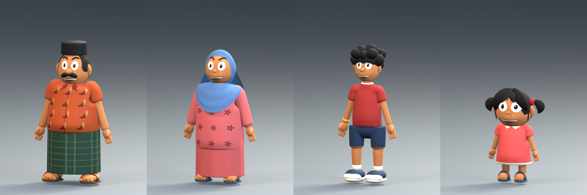

# Refined human cast

The four approved family sheets have been interpreted as rigged Blender characters, and that direction has been extended to all 13 human models in the game. The existing city, buildings and vehicle art use their original materials. Characters use a separate, softer shader and colour atlas.

[Before and after family comparison](before-after-family.png) · [Other cast and NPCs](after-npcs.png) · [All 13 characters](after.png) · [Gameplay-scale readability](gameplay-strip.png)

Changes include smooth cheek and jaw forms, eyes fitted to the face, rounded hair, continuous trousers and skirts, patterned garments, cleaner hands and sandals, and sleeve geometry that keeps evenly spaced vertices through animation bends. Costume and crowd recolours preserve the new palette's other colours and material values.

The existing character asset IDs, Unity GUIDs, shared animation controller and action names are retained. The importer rebuilds the humanoid bone mapping for the regenerated geometry while retaining animation clip references. Characters fit inside compact cars through an automatic seated scale adjustment; standing and motorcycle riding use their authored size.

## Play and edit

- Open `Builds/RefinedCharacters/Windows/KampungRunKL.exe` with its accompanying data files to play the current scene with this cast. Build status is recorded in [the Windows build report](unity/windows-build.txt).
- Open `Assets/Scenes/KampungRun.unity` in Unity and press Play to work in the project.
- Editable packed Blender masters and exports are under `Tools/refined_characters/<character ID>/`. [Source inventory and regeneration commands](../../../Tools/refined_characters/README.md).
- Use **Kampung Run → Build Refined Character Preview (Windows)** to rebuild the current saved scene without regenerating it or the animation controller.

## Evidence

- [Published asset hashes and retained GUIDs](published-assets.json).
- [Blender visual review](blender-review.md), including the final family, NPC and animation pose sheets.
- [Blender geometry, weights, texture and rig report](../../../Tools/refined_characters/review/final-technical/validation.json) and [FBX reimport report](../../../Tools/refined_characters/review/final-technical/roundtrip.json): all 13 pass the chosen 80,000-triangle LOD0 ceiling, four-influence skinning, normalized weights and texture checks. Each export includes a reduced LOD and the existing 15 authored takes.
- [Unity import, palette, avatar and pose validation](unity/validation.txt), plus the [final seven-character trouser update](unity/trouser-update/validation.txt).
- [Focused gameplay results](unity/gameplay-results.xml), covering cast and costumes, vehicle transitions, and all 35 tested hero/car pairings with scale restoration after exits and motorcycle use.
- [Final targeted gameplay results](unity/final-targeted-gameplay-results.xml), refreshing the cast/transition checks and Aiman's seven car pairings after the last trouser update.
- [In-game screenshots](unity/gameplay/) and [reproduction commands](unity/README.md).
- [Build-time protected file hashes](unity/preserved-assets-build.json). These compare the saved scene, controller and three pre-existing edited scripts over the build interval.

The [calibrated family comparison](../../../Tools/refined_characters/refs/family_final_findings.md) records remaining differences from the source sheets. These are game interpretations rather than exact sculpted replicas: hair silhouettes, hand proportions, scarf drape and smaller costume details are simplified. NPC adaptations have no separate approved orthographic sheets. Clothing uses bone weights rather than cloth simulation, and the existing movement choreography remains in use. No frame-rate benchmark is claimed.

Original character FBXs and Blender sources are retained under `Tools/refined_characters/review/original-fbx` and `review/baseline-sources` for comparison or recovery.
