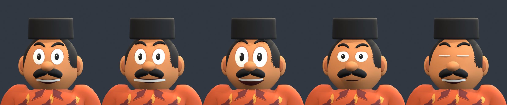

# Blender review — 26 September 2026

All 13 staged characters pass the technical source and clean FBX-import checks. The final renders use the delivered geometry: uniform garment and trouser topology through the animated bends. The earlier sleeve and knee ridges are resolved in the sampled poses.

- LOD0: 55,608–79,208 triangles, within the chosen 80,000 ceiling.
- LOD1: 15,569–22,178 triangles.
- Every character retains the 23-bone rig and all 15 authored animation takes.
- Both LODs have normalized weights, at most four influences per vertex, valid bone references, UVs, resolved palette textures and positive object scale. No unweighted vertices or zero-area faces were detected.
- Clean FBX import preserves mesh triangle counts, bone sets, physical height and animation durations.

[Geometry and skinning report](../../../Tools/refined_characters/review/final/validation.json) · [FBX roundtrip report](../../../Tools/refined_characters/review/final/roundtrip.json)

Each character has front, side, back and three-quarter views and six sampled action poses: walk frame 8, run 5, ride 0, punch 4, wave 6 and kick 7. These sheets were inspected for exposed skin at sleeve joins, disconnected garments, long-triangle bending artifacts and gross deformation. No further blockers were found in these samples. This is a sampled pose review, not an exhaustive check of every animation frame.

[Family lineup](after-family.png) · [Original above / refined below](before-after-family.png) · [NPC lineup](after-npcs.png) · [All characters](after.png) · [Game-size color and grayscale strip](gameplay-strip.png)

Family order is Pak Mat, Mak Som, Along and Adik. NPC order is recorded in [lineup-order.json](lineup-order.json). All full view, pose and export renders are retained in `Tools/refined_characters/review/final/`.

Expression order is neutral, Grin, Alarm, Determined and Blink, with each named morph set to 1. The render uses the actual source morphs; no image edits simulate the expressions.

The calibrated source comparison remains a separate check. The cast interprets the approved sheets, and NPC styling is inferred. Clothing uses bone weights rather than cloth simulation, and poses retain the existing choreography. The studio floor is a presentation aid: the ride pose is designed to be positioned by the game, and its feet may intersect that floor. Unity gameplay evidence and vehicle-fit tests are documented separately in [the delivery notes](README.md).
